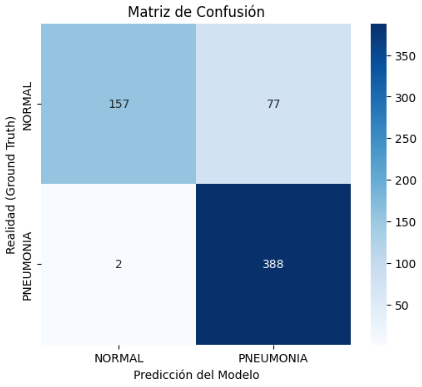

# 🫁 Clasificación de Neumonía en Rayos-X Pediátricos: CNN vs ViT


## 📋 Descripción
Este proyecto académico (Universidad de Murcia) aborda el problema de la **detección automática de neumonía** en imágenes de rayos-X de tórax en pacientes pediátricos. 

Se ha implementado un flujo de trabajo completo de Ingeniería de Datos y se han comparado dos paradigmas de *Deep Learning*:
1.  **Redes Neuronales Convolucionales (CNN):** Arquitectura clásica (ResNet/DenseNet) eficiente en extracción de características locales.
2.  **Vision Transformers (ViT):** Arquitectura basada en mecanismos de atención para capturar dependencias globales.

El proyecto pone especial énfasis en la **explicabilidad del modelo (XAI)** para su uso como herramienta de soporte clínico.

## 🗂️ Dataset y Preparación
Se utilizó el dataset **Chest X-Ray Images (Pneumonia)**.
* **Desafío:** Alta variabilidad en dimensiones (imágenes desde 384px hasta 2900px de ancho).
* **Solución:** Pipeline de preprocesamiento con redimensionamiento a 224x224, normalización estadística (ImageNet) y *Data Augmentation* para entrenamiento robusto.
* **Balanceo:** Implementación de `WeightedRandomSampler` para corregir el desbalanceo de clases (Prevalencia de Neumonía > Normal).

## 📊 Rendimiento del Modelo
Los modelos fueron evaluados priorizando la métrica de **Recall (Sensibilidad)**, crítica en medicina para minimizar los falsos negativos.

| Arquitectura | Accuracy | Recall (Clase Pneumonia) | 
|--------------|----------|--------------------------|
| **CNN (ResNet)** | 85 % | 99.74 % | 
| **Vision Transformer**| 87 % | 99.49 % | 

### Visualización de Resultados
Matriz de confusión mostrando el desempeño en el conjunto de test:



## 🔍 Explicabilidad (XAI)
Para validar que el modelo no aprende sesgos espurios, se utilizó **Grad-CAM**. Como se observa abajo, el modelo centra su "atención" (zonas cálidas) en las opacidades pulmonares características de la neumonía:


## 🛠️ Stack Tecnológico
* **Lenguaje:** Python 3
* **Framework DL:** PyTorch, Torchvision
* **Data:** Pandas, NumPy, Glob
* **Visualización:** Matplotlib, Seaborn, OpenCV

## 🚀 Instalación y Uso

1. Clonar el repositorio:
   ```bash
   git clone [https://github.com/](https://github.com/)[pablomargal]/pneumonia-classification-project.git